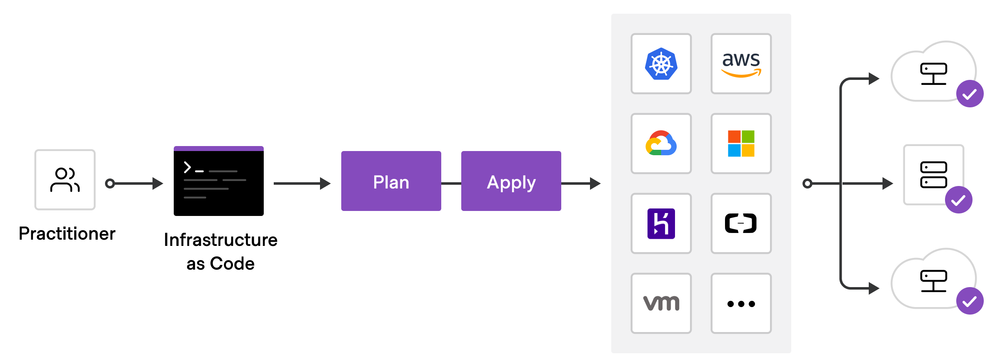

# Introduction to Infrastructure as Code with Terraform

## Terraform Explained

<iframe width="560" height="315" src="https://www.youtube.com/embed/HmxkYNv1ksg" title="YouTube video player" frameborder="0" allow="accelerometer; autoplay; clipboard-write; encrypted-media; gyroscope; picture-in-picture" allowfullscreen></iframe>

Infrastructure as code (IaC) tools allow you to manage infrastructure with configuration files rather than through a graphical user interface. IaC allows you to build, change, and manage your infrastructure in a safe, consistent, and repeatable way by defining resource configurations that you can version, reuse, and share.

Terraform is HashiCorp’s infrastructure as code tool. It lets you define resources and infrastructure in human-readable, declarative configuration files, and manages your infrastructure’s lifecycle. Using Terraform has several advantages over manually managing your infrastructure:

* Terraform can manage infrastructure on multiple cloud platforms.
* The human-readable configuration language helps you write infrastructure code quickly.
* Terraform's state allows you to track resource changes throughout your deployments.
* You can commit your configurations to version control to safely collaborate on infrastructure.

### Manage any infrastructure

Terraform plugins called providers let Terraform interact with cloud platforms and other services via their application programming interfaces (APIs). HashiCorp and the Terraform community have written over 1,000 providers to manage resources on Amazon Web Services (AWS), Azure, Google Cloud Platform (GCP), Kubernetes, Helm, GitHub, Splunk, and DataDog, just to name a few. Find providers for many of the platforms and services you already use in the Terraform Registry. If you don't find the provider you're looking for, you can write your own.

### Standardize your deployment workflow

Providers define individual units of infrastructure, for example compute instances or private networks, as resources. You can compose resources from different providers into reusable Terraform configurations called modules, and manage them with a consistent language and workflow.

Terraform’s configuration language is declarative, meaning that it describes the desired end-state for your infrastructure, in contrast to procedural programming languages that require step-by-step instructions to perform tasks. Terraform providers automatically calculate dependencies between resources to create or destroy them in the correct order.

### To deploy infrastructure with Terraform:

1. Scope - Identify the infrastructure for your project.
1. Author - Write the configuration for your infrastructure.
1. Initialize - Install the plugins Terraform needs to manage the infrastructure.
1. Plan - Preview the changes Terraform will make to match your configuration.
1. Apply - Make the planned changes.

