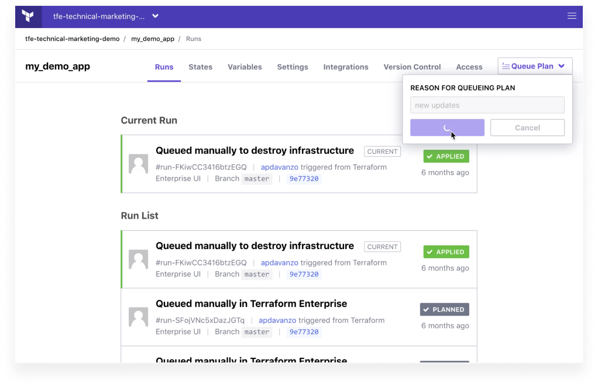
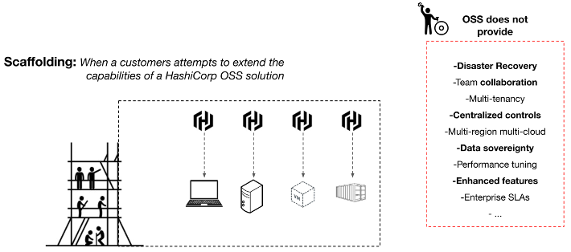
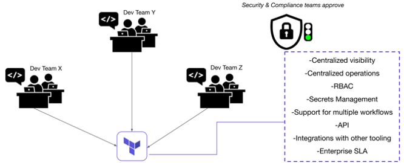

# Terraform Cloud For Business (TCFB)

Terraform Cloud is the fastest way to adopt Terraform, the world’s most widely used multicloud provisioning product. Offered as a service, Terraform Cloud provides all of the tools that practitioners, teams, and global businesses require to create and collaborate on infrastructure and to manage risks for security, compliance, and operational constraints.

## Terraform Open Source (OSS)

Most organizations start using the open source version of Terraform to get a feel for how it works locally, how HCL is used in `.tf` files, and how the plan->apply (and even destroy) work. They often tie it to local Git repositories or online remote services. But as adoption increases, concerns like disaster recovery, multitenancy, SLAs, and performance-tuning come to the forefront.

## Terraform Cloud

As a full SaaS service, Terraform cloud solves all these concerns. Features include centralized visibility and operations, role-based access control (RBAC), secrets management, multiple workspaces and flows, API access, and integrations with other tooling (such as Intersight). Full disaster recovery is tied into Enterprise SLAs.

**Next: Integrating Intersight with Terraform Cloud**
