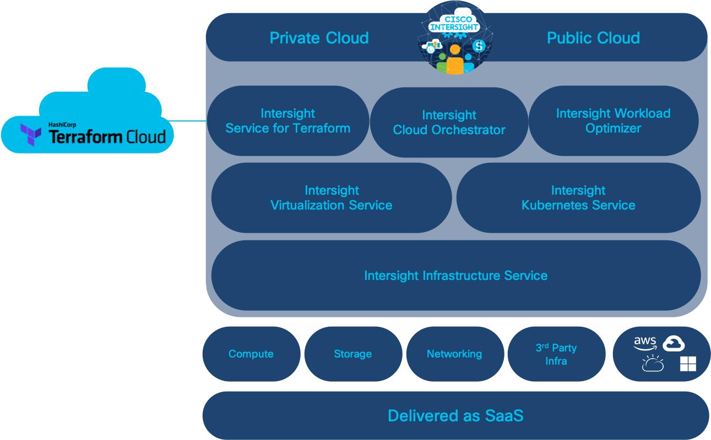
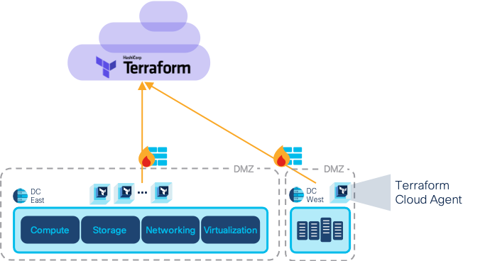
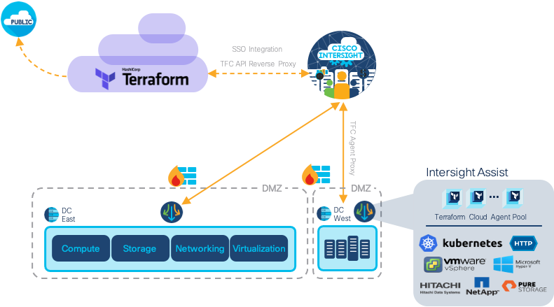

# Intersight Service for Hashicorp Terraform

As we discussed at the beginning, inconsistency among environments leads to issues during deployments. Also, the administration and maintenance of environment infrastructure often involves manual, difficult-to-track processes that contribute to errors and reduced productivity.

The Cisco Intersight Service for Hashicorp Terraform (referred to as Intersight Service for Terraform, Cisco IST, or IST) enables you to track changes and repeat them the same way, each time. The changes are accessible and anyone with the appropriate permissions can repeat them. This pattern makes the changes consistent and trackable and provides end-to-end accountability.

Intersight supports Terraform Cloud as a SaaS product.

You can use the Cisco IST to deploy complex infrastructure, including multi-tier applications, self-service clusters, software demos, disposable environments, multicloud deployments, and more.

## Orchestration UI

You can use Intersight Orchestrator (IO) to execute workflows that can run Terraform configuration in a Terraform Cloud workspace, and configure UI tasks through Intersight, or through Terraform.

Provider credentials are part of the Terraform configuration or workspace variables.

You can also invoke Terraform Cloud scripts through IO Workflows. This mode of operation enables you to incorporate solutions with Intersight Workflows and Terraform Cloud actions. For example, you can set up a private infrastructure on a VMware Datacenter with Terraform Cloud or agent, and also configure additional postprocessing with Ansible playbooks.

The following Terraform Cloud configurations are available with the supported APIs:

* Terraform Cloud configuration that is executed on public cloud
* Terraform Cloud configuration that is executed on a datacenter

## Terraform Cloud Agent

To run Terraform configurations in private datacenters that may not have direct ingress internet connectivity, Intersight users can enable the Terraform Cloud Agent on Cisco Intersight Assist in the datacenter. The agent is treated as a global resource within an organization. 

You can then invoke deployments on workspaces that are configured in agent mode in Terraform Cloud. The Terraform agents reach the endpoints in private datacenters to perform the required actions.

Terraform Cloud provides a solution for running Terraform code in environments that are isolated, on-premises, or private: provisioning a Terraform Cloud Agent in the private environment. The agents are pull-based, which means that inbound ports are exposed by the private infrastructure.

The agent uses a Docker image that is available at [Docker Hub](https://hub.docker.com/r/hashicorp/tfc-agent/tags). Intersight maintains and updates the agent images in an internal Docker registry. The agent is instantiated as Kubernetes pods in an Intersight Assist Appliance.

## Intersight Assist

Intersight Assist securely extends the ability to manage, automate, orchestrate, and optimize on-prem infrastructure and software.

* __Simple__: Intersight manages the end-to-end lifecycle (deployments, upgrades, scaling, networking) of Terraform Cloud Agents.
* __Extensible__: Our growing library of integrations with Terraform, Pure Storage, NetApp, Hitachi, and VMware are just the beginning.
* __Secure__: Intersight Assist is a hardened appliance with seamless upgrades and management from Intersight’s SaaS platform.

**Congratulations! You have completed "Introduction to Intersight Service for Hashicorp Terraform". Return to [the DevNet Infrastructure as Code page](https://developer.cisco.com/iac)**
