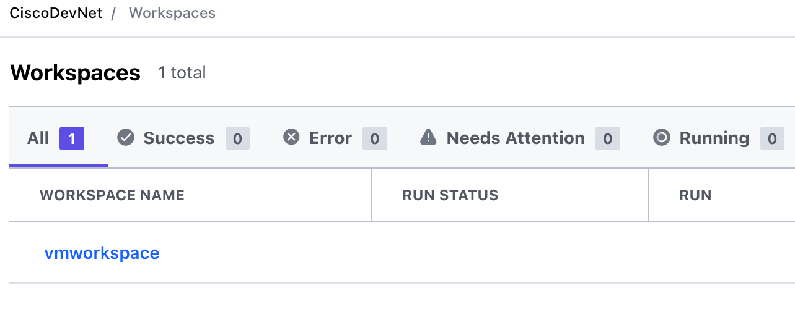

# Access the Terraform Workspace

Terraform workspaces enable you to collect the activities of infrastructure management into one place. This Learning Lab manages one workspace that references the Terraform elements that successfully provision VMs to vSphere.

## Open the workspace and configure VM variables

Select __vmworkspace__. 

Click __Configure Variables__.

You can change the following variables: 
* Number of VMs (`vm_count`)
* Number of CPUs per VM (`vm_cpu`)
* RAM allocated to each CPU (`vm_memory`). 

Click on the three dots to the right of each variable and choose __Edit__ to change the value.

**Next: Run the Terraform Plan**
