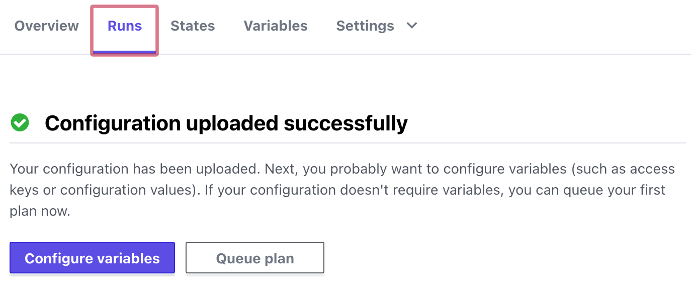
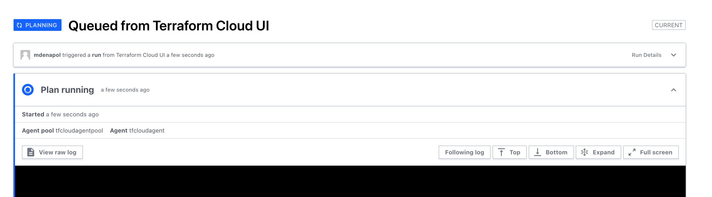
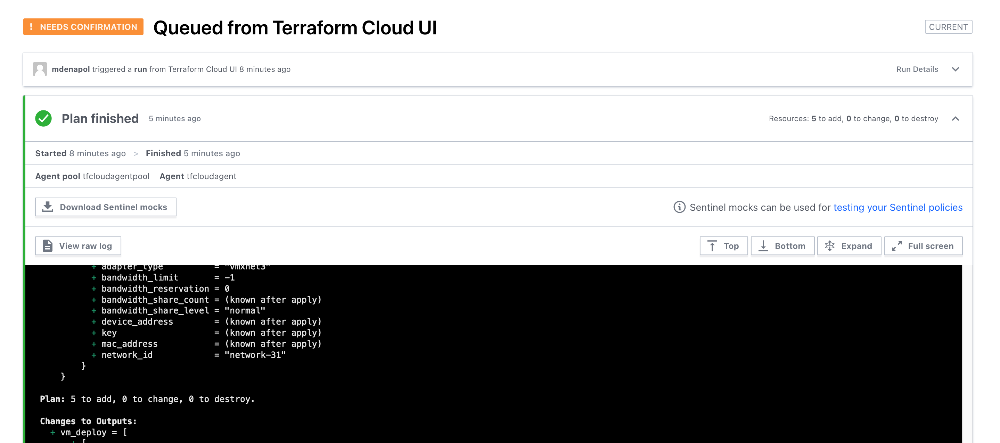
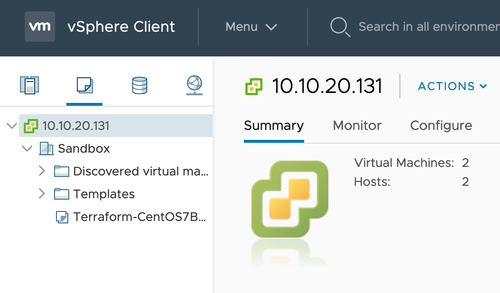

# Run the Terraform Plan

A Terraform plan enables you to *check* the result of the desired end state changes without making the changes. You can confirm that the changes are permissible and will not cause any undesired results.

## Queue the plan

On the __Runs__ tab, click __Queue the Plan__ to initiate the *plan* phase of the provisioning.

A successful trigger shows the plan running.

A confirmation shows when the plan is complete.

Although the plan is complete, no actions have been taken. You can verify this by navigating back to [vSphere](http://10.10.20.131).

Click the second menu item. You can see that NO VMs are provisioned.

**Next: Apply the Plan**
