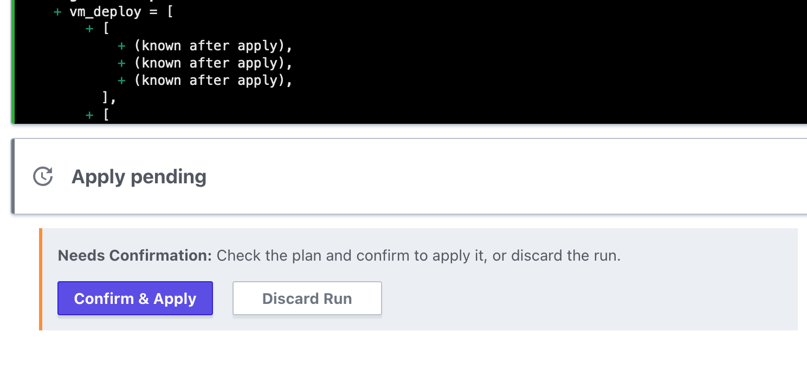
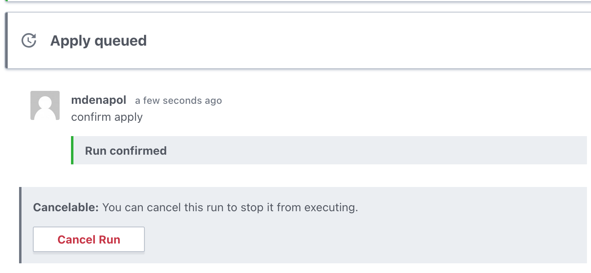
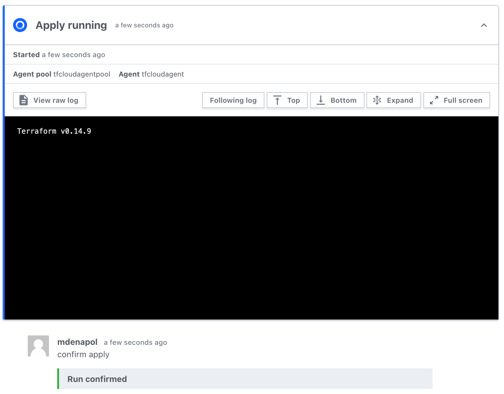
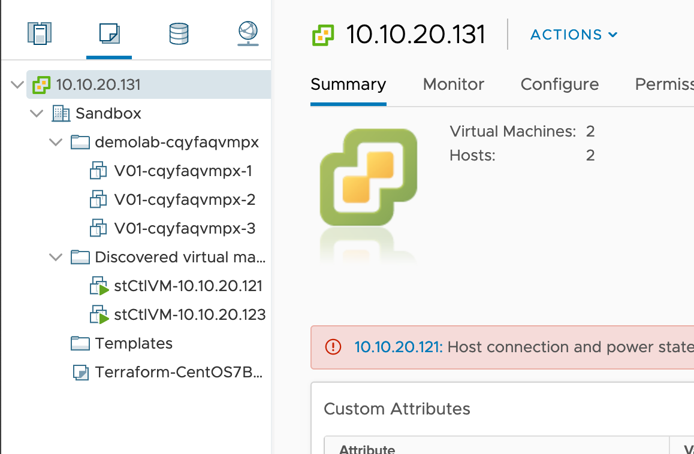
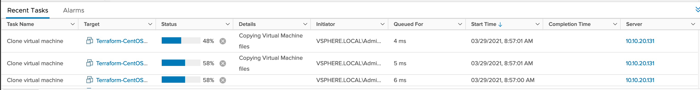
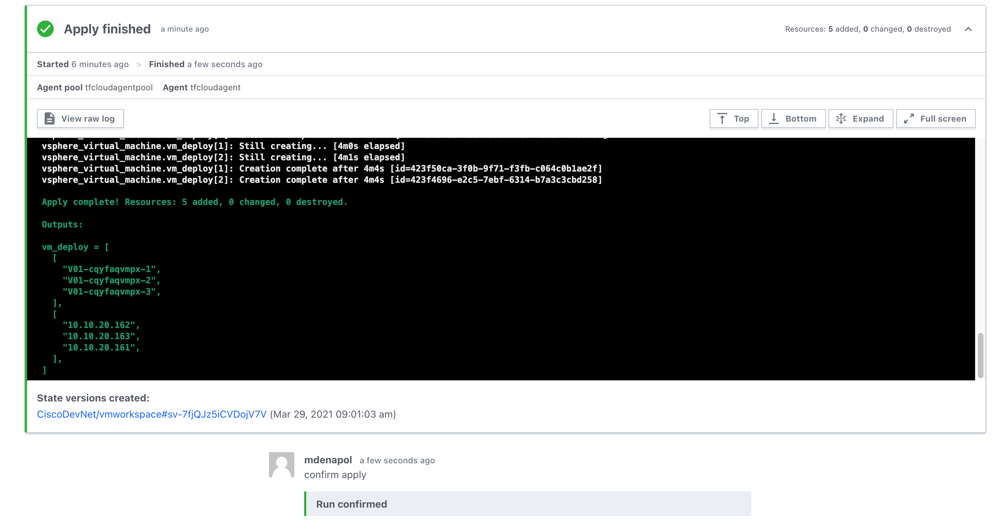
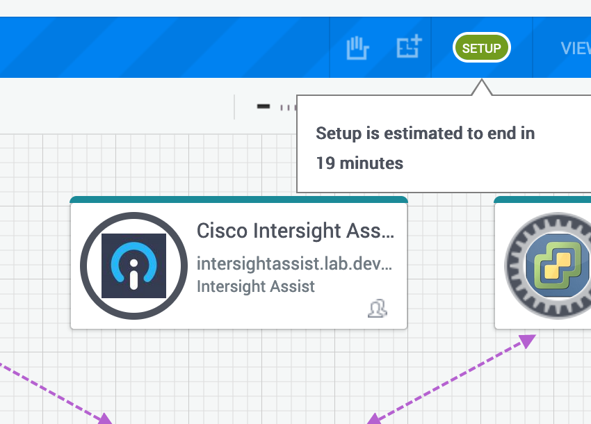

# Run the Terraform Apply

Now that you are satisfied with the plan, you can apply your changes and provision the VMs to vSphere.

## Apply the Plan

Back in Terraform Cloud, open the __Runs__ tab. Scroll to the bottom of the completed plan. Click __Confirm and Apply__.

If the apply is successfully queued, you see the following confirmation:

Another confirmation shows that the apply is in progress:

Return to to [vSphere](http:10.10.20.131) and observe the VMs that vSphere creates based on your configured variables.

Once the apply is complete, Terraform Cloud returns a message indicating success:

Now that you have completed this Learning Lab, end your reservation by clicking the **End reservation** button in the [Sandbox](https://devnetsandbox.cisco.com/RM/Diagram/Index/0e9e018d-3c2f-4bc8-acd9-1caa1ef81a48). Doing so releases the Sandbox and resets it for the next user.

**Congratulations! You've completed the Intersight Service for Terraform VM Provisioning Lab.**
