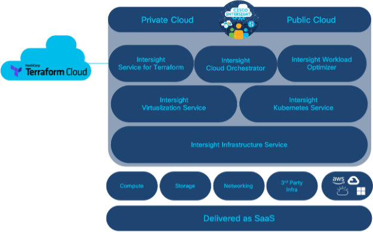
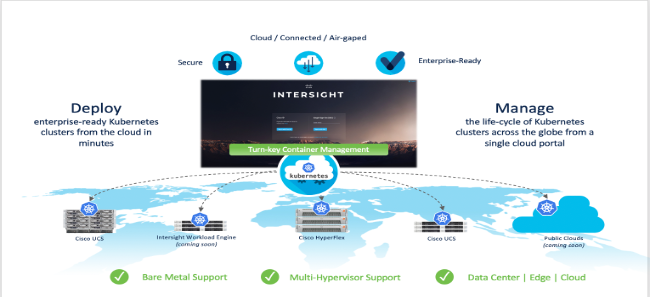
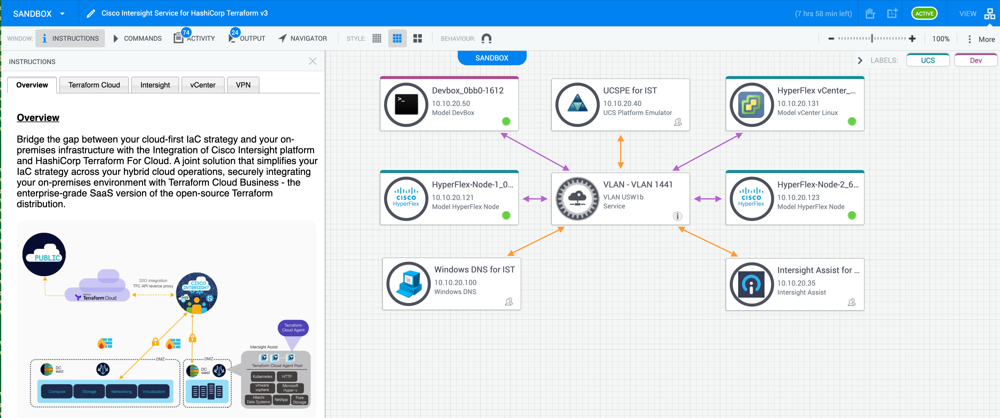
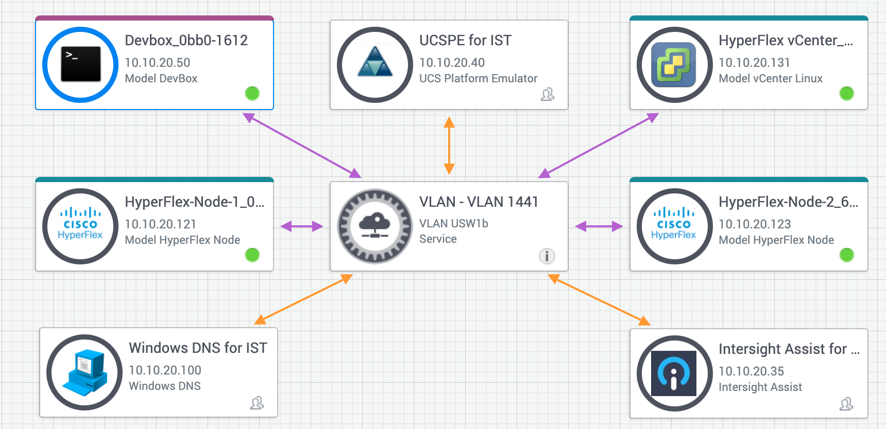

# Introduction

This Lab introduces Infrastructure as Code (IaC) and demonstrates how the Intersight Service for Hashicorp Terraform (IST) extends the capabilities of Cisco Intersight to manage infrastructure across private and public clouds. [Provisioning VMs using Intersight Terraform Service for Hashicorp](https://developer.cisco.com/learning/lab/intersight-02-ist-vm-automation/step/1), focused on a simple use case to provision a VM in your private data center. This Lab uses IST to provision a Kubernetes cluster with Intersight Kubernetes Service (IKS) and demonstrates how to deploy a sample containerized application.

## Objectives

When you complete this Learning Lab, you will be familiar with:
*	Interactivity of Terraform Cloud with Intersight, Intersight+Terraform Assist, and Intersight+Terraform Cloud Agent
*	Accessing Terraform Cloud and observe Terraform workspaces.
*	Registering Intersight targets for Terraform Cloud and Terraform Cloud Agents.
*	As Cloud Admin, creating IKS policies to be leveraged by k8s clusters.
*	As DevOps, creating a k8s cluster leveraging IST and IKS.
*	As an app developer, deploying a sample app leveraging IST and Helm.

## Audience
*	Cloud Admins who want to provide IT Container As A Service (CAAS) on vSphere Infrastructure  
*	DevOps who want to deploy and manage k8s clusters for their app developers with containerized workloads
*	App developers who want to leverage IST and Terraform Helm Provider to onboard their containerized workloads on k8s clusters

> *Note:* In these exercises, follow the instructions without modifying any other attributes or deleting any resources. You will have admin rights to the Intersight account created for this sandbox and must not misuse these rights to delete any pre-provisioned resources.

## Related Technologies

### Terraform Cloud for Business - TFCB

*	Centralized visibility and operations for every member of the team
*	Native integration with HashiCorp Vault for Secrets Management
*	Workspaces help organize infrastructure files and workflows
*	Full API allows users to set Triggers and Notification for end-to-end automation of IaC pipelines
*	Integrations with other tooling such as Version Control Systems and SSO
*	Enterprise SLA

### Intersight Service for Terraform - IST
*	Management: reduce operational complexity by removing the need to manage IaC agents
*	Security: consolidate access through one communication point in Intersight
*	Orchestration: Terraform APIs accessible through Intersight

### Intersight Kubernetes Service - IKS

IKS is a SaaS-delivered, turn-key container management platform for multicloud, consistent production-grade Kubernetes. It:

*	runs on ANY infrastructure as a lightweight self-hosted software. Optimized for Cisco HX and UCS, deployed on top of VMware vSphere, with bare metal options coming soon
*	automates the installation, deployment and lifecycle management (OS updates/Kubernetes updates) of 100% upstream self-service K8s clusters via an easy-to-use simple ser interface
*	includes all the necessary networking (CNI, ACI CNI, Istio service mesh), persistent storage (CSI), logging (EKF), monitoring (Prometheus/Grafana), L4/L7 load balancing and registry tooling, RBAC configuration
*	integrates with AWS, Azure, and Google Cloud (coming soon)
*	is built for the enterprise with hardened security and enhanced availability features like multi-master nodes and self-healing
*	optimized for AI/ML workloads with multi-GPU support

## Prerequisites
Please make a reservation at the following Intersight Service for Hashicorp Terraform for IKS Sandbox:

https://devnetsandbox.cisco.com/RM/Diagram/Index/daad55dd-45f1-46c6-a1b4-7339b318c970?diagramType=Topology

Upon reservation, you will have received another email indicating access to VPN credentials.

Follow those instructions to connect to the necessary VPN connection (this is necessary to access the vSphere, IKS cluster and App instance later.)

## Pre-configured elements (Sandbox Topology)

To make for a consistent experience, the following elements are pre-configured in the accompanying sandbox environment.

##### Lab user accounts in Intersight SAAS
Intersight is a SaaS-delivered, common platform for intelligent visualization, optimization, and orchestration for applications and infrastructure across hybrid cloud. Lab user will be provided with a temporary account for the duration of this sandbox. You will need this to execute some manual steps later in the lab.

##### Lab user account, team, workspaces in Terraform Cloud For Business (TFCB) 
Terraform Cloud Business is the SaaS deployment of Terraform. Once you log in to Terraform Cloud at app.terraform.io with your username and password that you used for the sandbox reservation, you will be able to view the pre-provisioned workspaces that you will execute during this lab. 

##### UCS Emulator
Cisco UCS Platform Emulator is the Cisco UCS Manager application bundled into a virtual machine (VM). The VM includes software that emulates hardware communications for the Cisco Unified Computing System (Cisco UCS) hardware that is configured and managed by Cisco UCS Manager.

##### Intersight Assist
Cisco Intersight Assist helps you add endpoint devices to Cisco Intersight. A datacenter could have multiple devices that do not connect directly with Cisco Intersight. Any device that is supported by Cisco Intersight but does not connect directly with it, will need a connection mechanism. Cisco Intersight Assist provides that connection mechanism, and helps you add devices into Cisco Intersight.

##### VMWare vSphere
This is the hypervisor managing the IKS cluster VM’s being created for k8s control plane and worker nodes.

##### Terraform Cloud
This is the Intersight target that is pre-provisioned in this sandbox to establish the connectivity with TFCB SAAS

##### Terraform Cloud Agent
This is the TFCB cloud agent that is enabled in the remote data center and is required to execute remote plans on the on prem infrastructure.

**Next: Login to Terraform Cloud for Business and observe workspaces**
