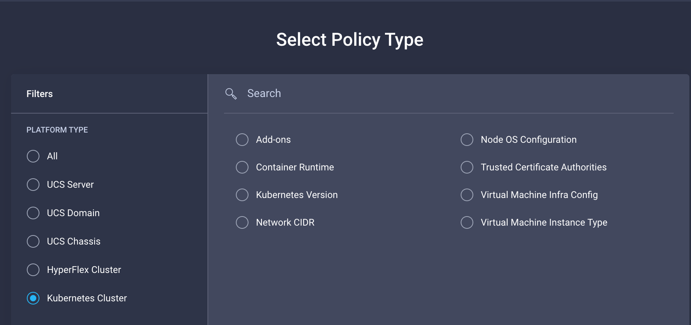
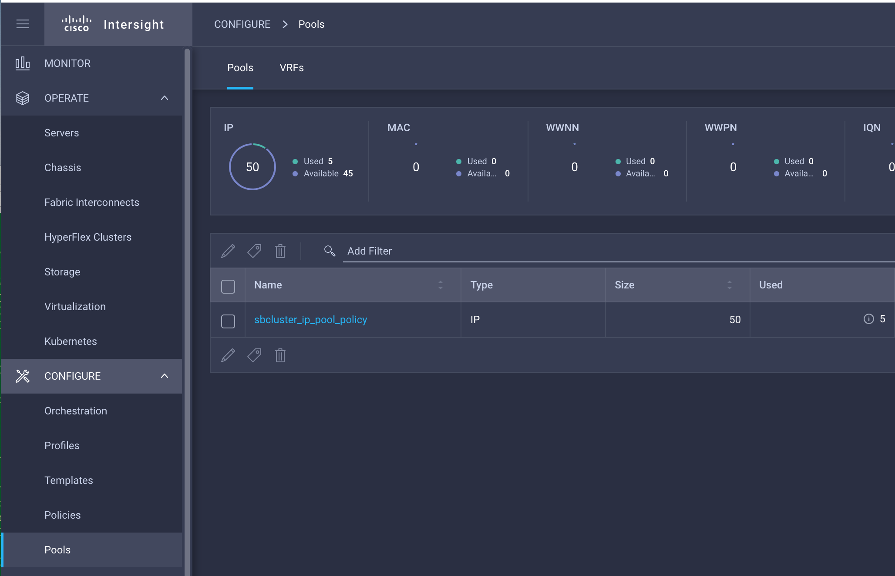

# Execute TFCB plan to create IKS policies

In this exercise, you assume a Cloud Admin persona to provision IKS policies that DevOps uses to provision an IKS cluster. You execute the TFCB plan, review the plan, and confirm the application of the plan to provision IKS policies in your remote data center (the Sandbox). 

> **Note:** The following policies are currently supported. However, for this Learning Lab, you configure the minimal policies for setting up a single node IKS cluster.

## Queue the plan

Open the `sb_k8sprofile-XXXX` workspace in TFCB. Confirm that the variables are correct for the `api_key` and `secretkey`. Click **Queue plan manually** to execute the plan to create the IKS policies.

## Review and confirm the plan

The TFCB formulates a plan. Review the plan and verify that the policy settings are provisioned for:

* Virtual Machine Instance Type
* Virtual Machine Infra Config
* Kubernetes Version
* Network CIDR
* Node OS Configuration

Confirm the plan to apply it to your infrastructure. When the run is complete, a **Run confirmed** message appears.

## Verify the configuration

Log in to Intersight and verify the configurations of the IP pool and the policies:

DevOps can now provision an IKS cluster that is based on the policies.

**Next: Execute the TFCB plan to create an IKS cluster**
