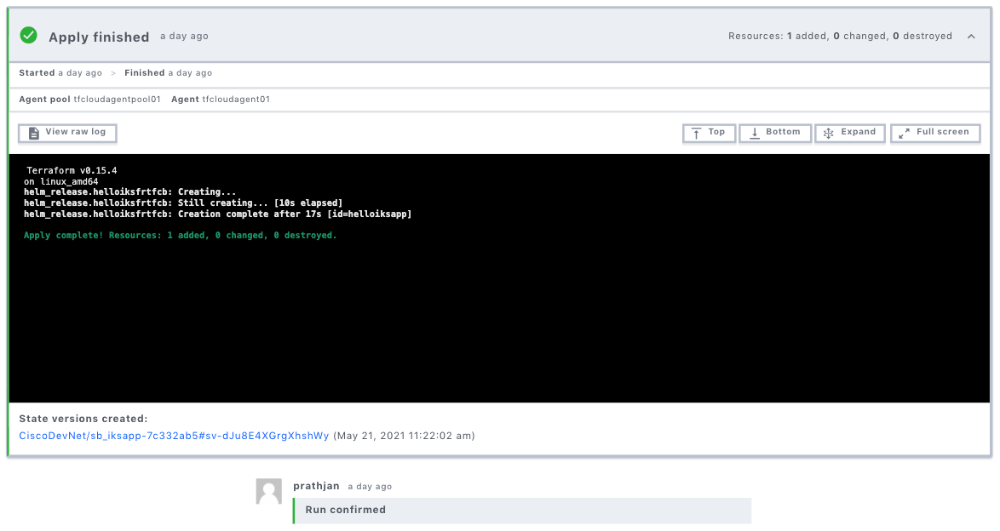
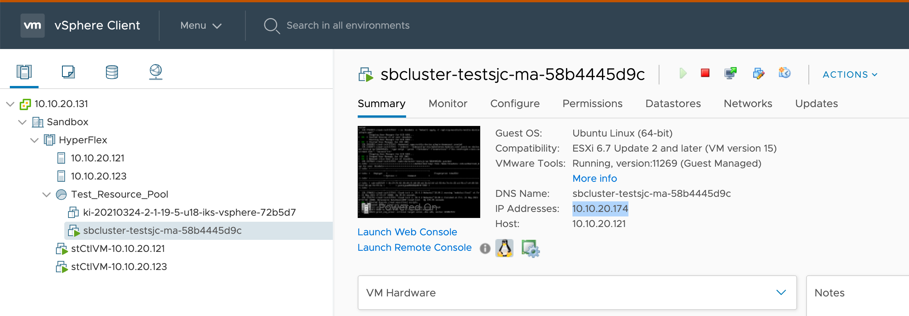
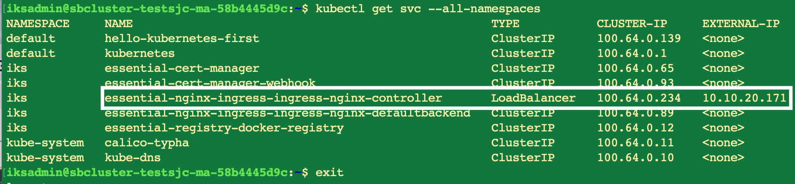
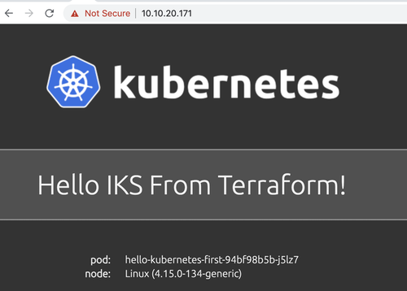

# Execute TFCB plan to deploy a sample app on the IKS cluster

In this exercise, you assume of an app developer. You deploy a sample app on the IKS cluster using Helm Terraform Provider and using IST.

## Queue the plan

Open the `sb_iksapp-XXXX` workspace in TFCB. Confirm that the variables are correct for the `api_key` and `secretkey`. Click **Queue plan manually** to execute the plan to deploy the sample app.


## Review and confirm the plan

The TFCB formulates a plan. Review the plan and verify the details of the sample app that you are deploying on the IKS cluster.

Confirm the plan to deploy the app to your infrastructure. TFCB uses its integration with Intersight to remotely and securely execute this plan. On a successful run, you see a successful deployment of the sample app:




## Log in to the control plane node of the IKS cluster 

Use `kubectl` commands on your IKS cluster to retrieve the Load Balancer IP that is configured for your ingress-controller. 

Retrieve the IP address of your control plane node by logging in to the vSphere client. Confirm that you have connected to the VPN that was specified in your Sandbox invitation email, and then log in to your Sandbox instance of vSphere:

* IP address: `10.10.20.131`
* User name: `administrator@vsphere.local`
* Password: `PurplePigChevy88!`

Browse to your IKS primary node and retrieve the ControlPlane IP address (`controlplane_ip`):



On the Sandbox DevBox, use the ssh private key that you generated in [Log into Intersight](https://developer.cisco.com/learning/lab/intersight-02-ist-vm-automation/step/3) to log into the cluster node:

```bash
ssh -i <path_to_private_ssh_key> iksadmin@controlplane_ip
```

To confirm access to the IKS cluster, run the following command:

```bash
kubectl get nodes
```

Retrieve the LoadBalancer external IP of your `ingress-nginx-controller`:

```bash
kubectl get svc --all-namespaces
```



Open the URL in a browser window. You should see something similar to the following example:



**Next: Terminating your Sandbox**