# Use Intersight UI to provision an IP Pool

As a Cloud Admin, you will allocate IP pools to the various application teams to provision their IKS clusters. You can either create a single pool that can be used for all of the IKS clusters or provision multiple IP Pools and assign each to individual application teams. 

**PLEASE USE THE VALUES SPECIFIED IN THE SNAPSHOTS. THESE ARE THE VALUES THAT APPLY TO THE SANDBOX CONFIGURATION.**

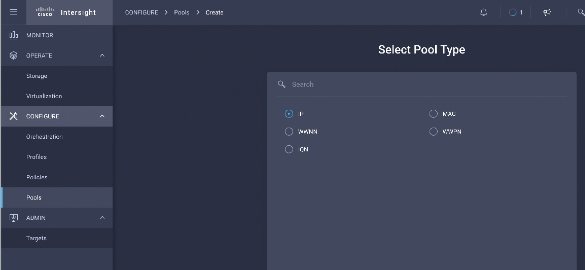

Provision the following with the Sandbox infrastructure parameters and click **Create**. You can skip the IPv6 tab for now since IPv6 is not supported currently.

```
Subnet Mask 255.255.255.0
Default Gateway 10.10.20.254
Primary DNS 10.10.20.100
Secondary DNS - NA
Start Address - 10.10.20.170
Number - 20
```

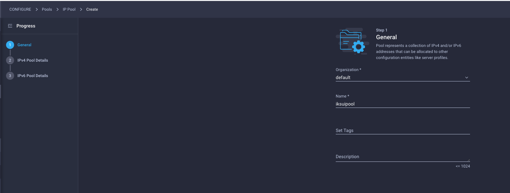

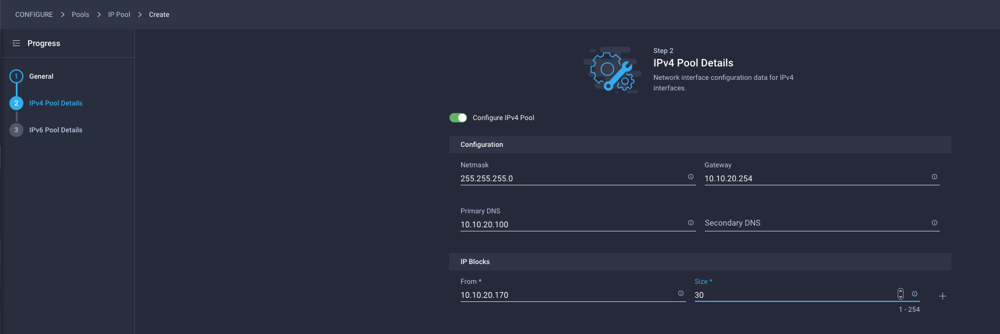

# Use Intersight UI to provision IKS policies

Next, you provision IKS policies that your DevOps teams will use to provision their IKS cluster. 

**PLEASE USE THE VALUES SPECIFIED IN THE SNAPSHOTS. THESE ARE THE VALUES THAT APPLY TO THE SANDBOX CONFIGURATION.**

The following are the policies that are available for you to configure:

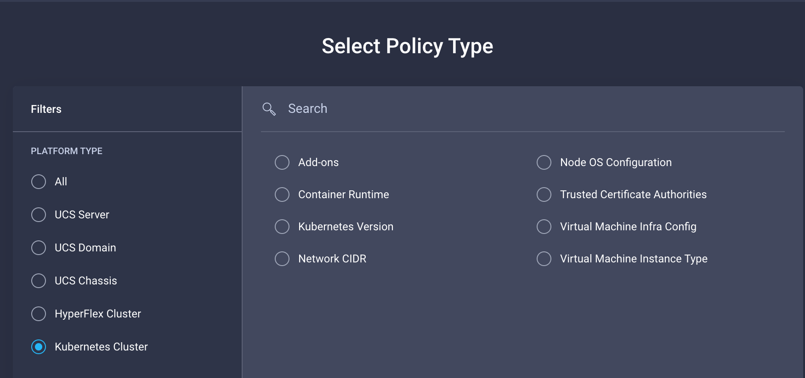


__1.__ Configure Kubernetes Version Policy:

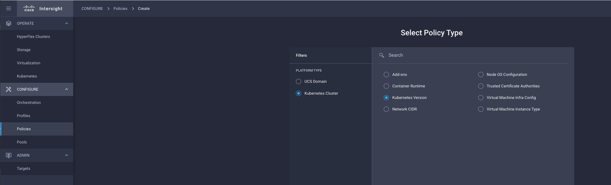

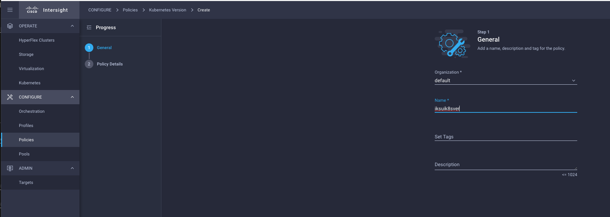

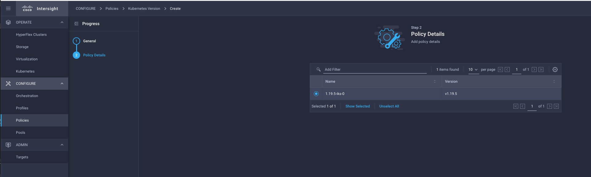


__2.__ Configure Network CIDR Policy:

```
POD Network CIDR - 100.65.0.0/16
Service CIDR - 100.64.0.0/24
```


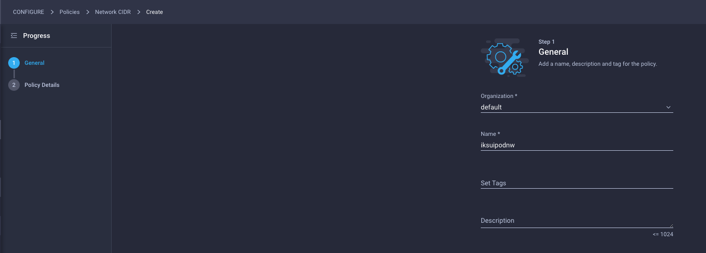

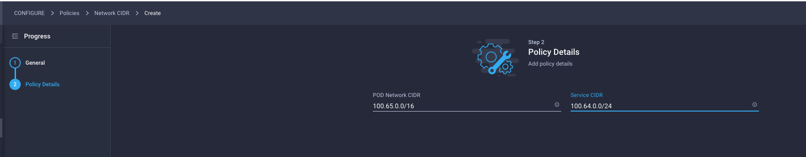


__3.__ Configure Node OS Policy

```
Timezone - America/New_York
DNS Suffix - demo.intra
DNS Server1 - 10.10.20.100
NTP Server1 - 10.10.20.100
```


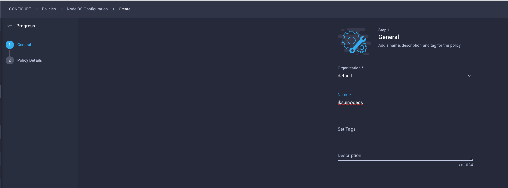

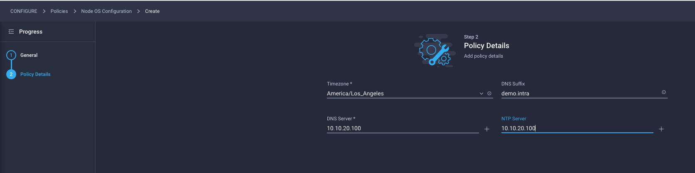


__4.__ Configure Virtual Machine Infra Config:

```
ESXi Cluster - HyperFlex
Datastore - SpringpathDS-10.10.20.121
Interface  - VM Network
Resource Pool - Test_Resource_Pool
vSphere Admin Passphrase - Enter the password that you got in your invitation email
```

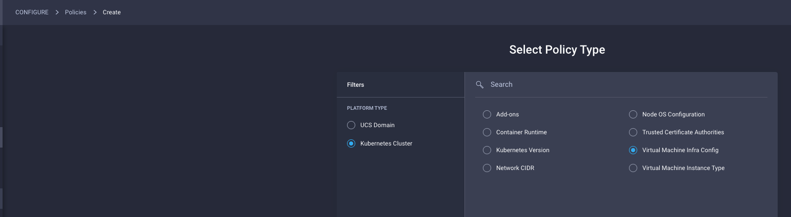

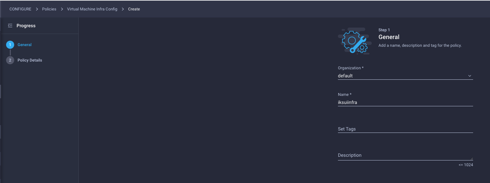

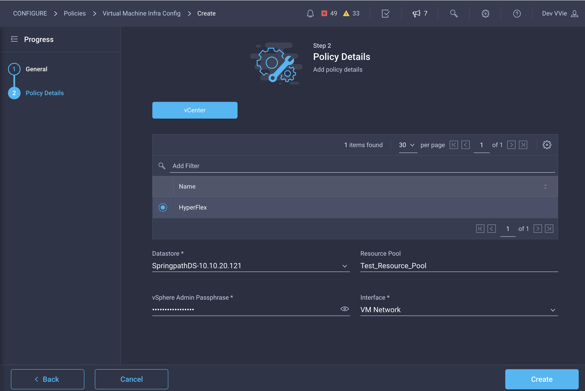


__5.__ Cofigure Virtual Machine Instance Type

```
CPU - 4
System Disk Size (GiB) - 40
Memory (MiB) - 16384
```

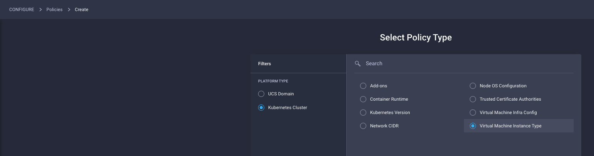

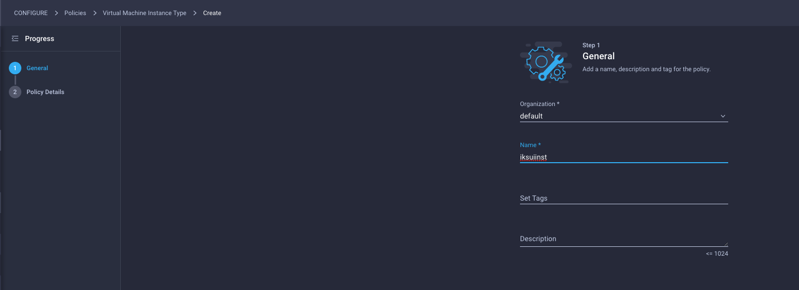

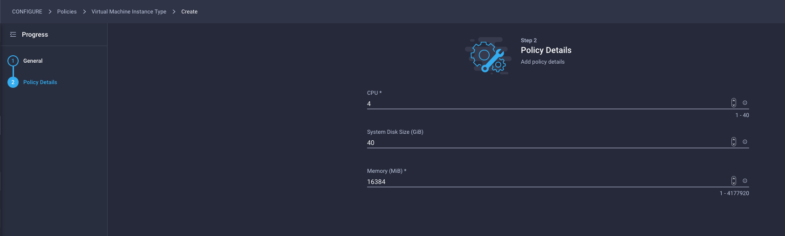


Your policy configuration listing should now looks as follows:

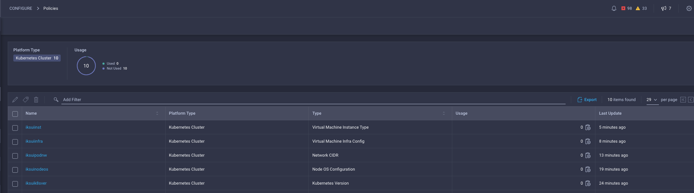


Your DevOps personnel can now provision an IKS cluster that is based on the above policies.
