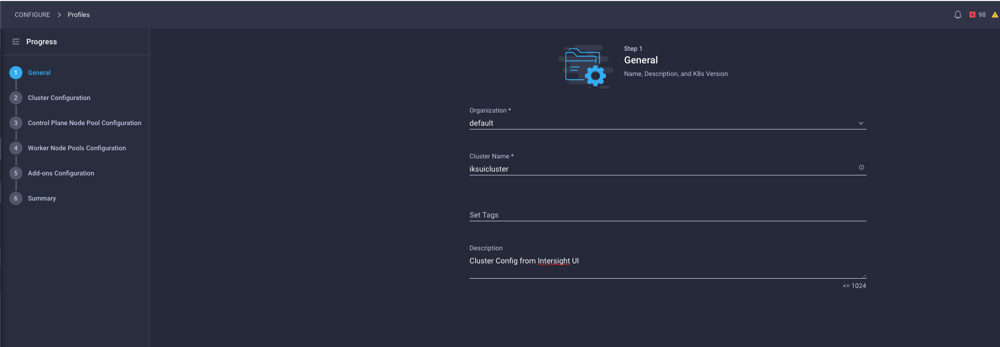
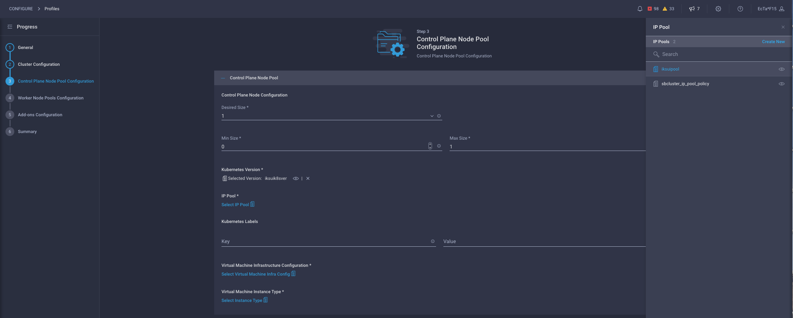

# Use Intersight UI to provision IKS profile for you IKS cluster

Next, you will provision an IKS Profile. This defines the IKS cluster that you want to create:

__1.__ Configure IKS General Info 

Intersight is Multi-Tenant and supports different organizations but for this Sandbox, select the default organization.

__2.__: Configure IKS Cluster - Select IP Pool 

This IP Pool will be used for the Loadbalancer Services that we shall create at a later stage. These IP's will be assisgned to the application running on the IKS cluster.

__3.__: Configure IKS Cluster - Select Node OS Policy 

This policy gets mapped under the DNS, NTP and Timezone section.

__4.__: Configure IKS Cluster - Select Network CIDR Policy 

__5.__: Configure IKS Cluster - Configure Load Balancer Count and SSH key. 

Enter the SSH public key that you generated before.

Click next, we won't configure any Trusted Registries or Container Runtime settings for now.

__6.__: Configure Control Plane Node Pool - Select Kubernetes Version

__7.__: Configure Control Plane Node Pool - Select IPPool

These are the IP's which are getting assigned to the Control PLane VM's.

__8.__: Configure Control Plane Node Pool - Select Virtual Machine Infra Config Policy

__9.__: Configure Control Plane Node Pool - Select Virtual Machine Instance Policy

__10.__: Configure Control Plane Node Pool - Select Desired Size for Control Plane

The Min and Max size are for upgrades, the desired size is the amount of control VM's that will be provisioned.

__11.__: Configure Worker Node Pools - Select ippool, name and number of worker nodes

__12.__: Configure Add-ons. You can skip this for now since we will address this in subsequent sections.

__13.__: Submit Cluster Provisioning Request

__14.__: Verify Cluster Provisioning Request is Configuring

__15.__: Examine Cluster Provisioning Request Workflow

__16.__: Verify that the cluster is configured:

Your App Developers can now deploy their containerized apps on the IKS cluster using kubectl or helm.