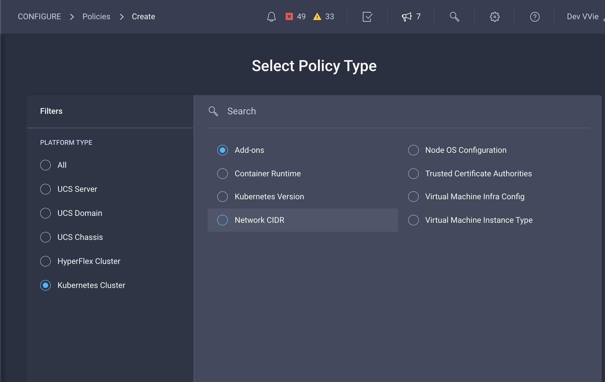
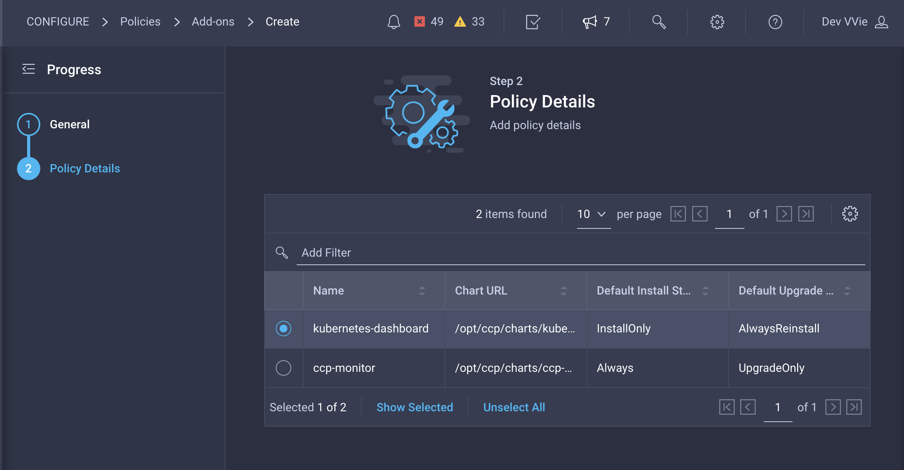
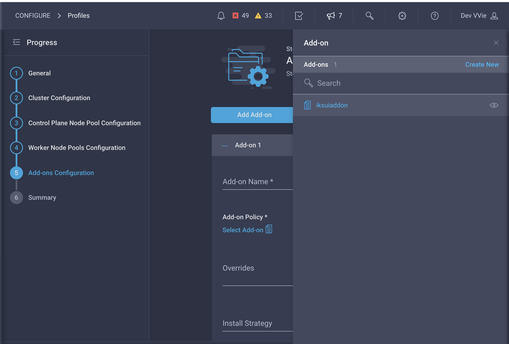
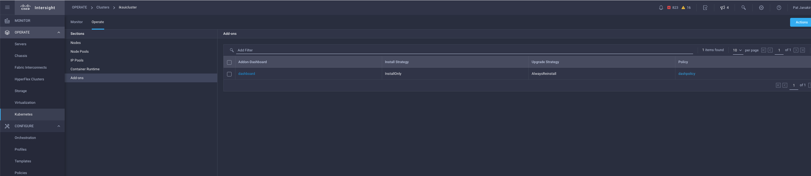
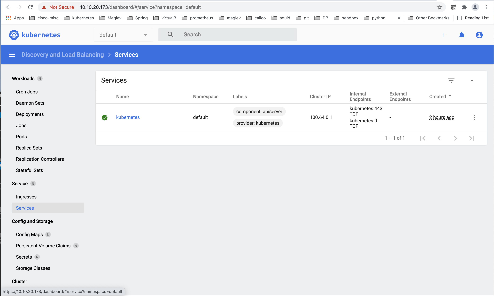

# Use Intersight UI to configure IKS Add-ons

__1.__: Connect to the Sandbox VPN with the credentials provided in your invitation email.

__2.__: Create a policy for the Dashboard Add-on:

__3.__: Update the cluster profile and include the Add-on policy. Leave the other fields empty and click **Deploy**:

__4.__: Connect to the control plane node of the cluster that you created

Get the Control plane node IP:

Download the kubeconfig for the cluster.

Connect to control plane node with ssh. Use the private key that you generated before.

ssh -i <your_private_ssh_key> iksadmin@ctrlplanenode-ip

__5.__: Execute the following commands to get the data for the Dashboard access

Get the name of the default token:

    kubectl --kubeconfig <cluster-kubeconfig> get secrets -n kube-system | grep default-token

Get the password: 

    kubectl --kubeconfig <cluster-kubeconfig> get secret default-tokvv -n kube-system -o jsonpath='{.data.token}' | base64 -D

__6.__: Access the Kubernetes Dashboard for your cluster

Navigate to **Operate -> Kubernetes -> Select your cluster -> Operate -> Add-ons** and click on your Add-on. You should now see your Kubernetes Dashboard lited. You can login with the Token you got in the previous step.

Access the Dashboard and enter the token acquired above:

Check out the cluster you just created with the Dashboard:

