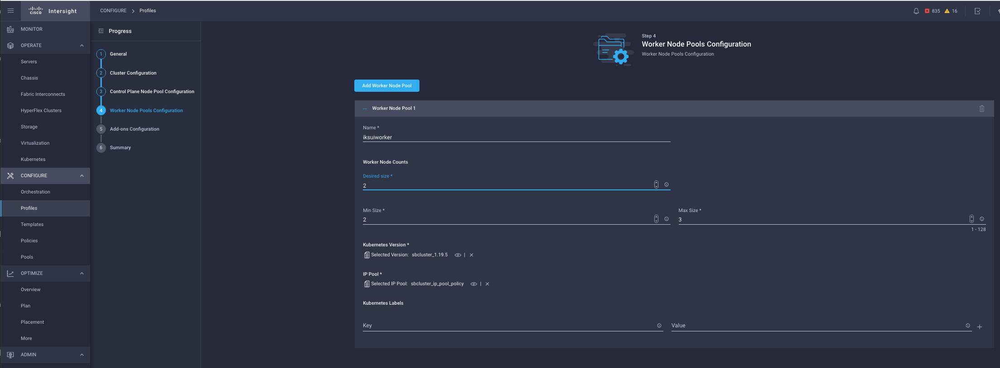
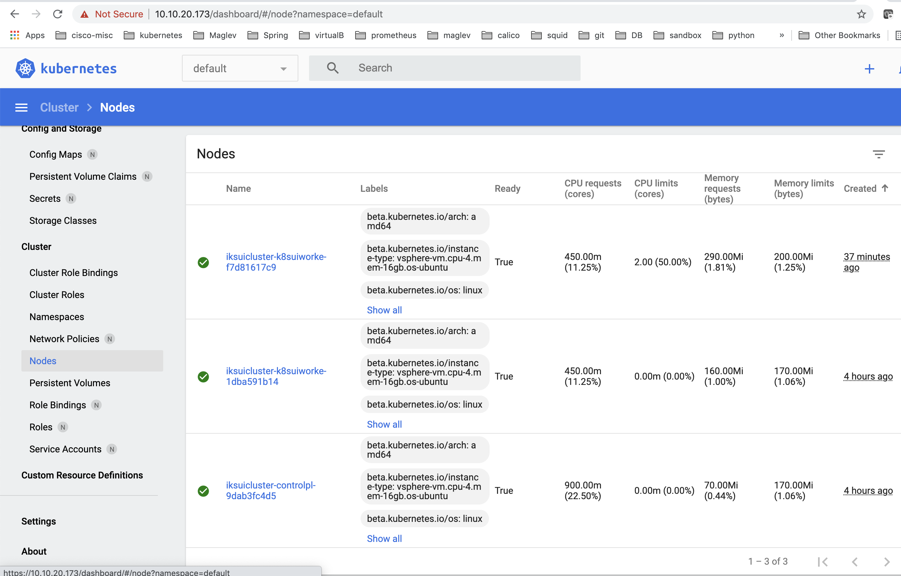

# Use Intersight UI to scale up the cluster

Update the cluster profile and increase the number of worker nodes. Click **Deploy**:

Refresh your Kubernetes Dashboard and see that the cluster has been scaled up:

