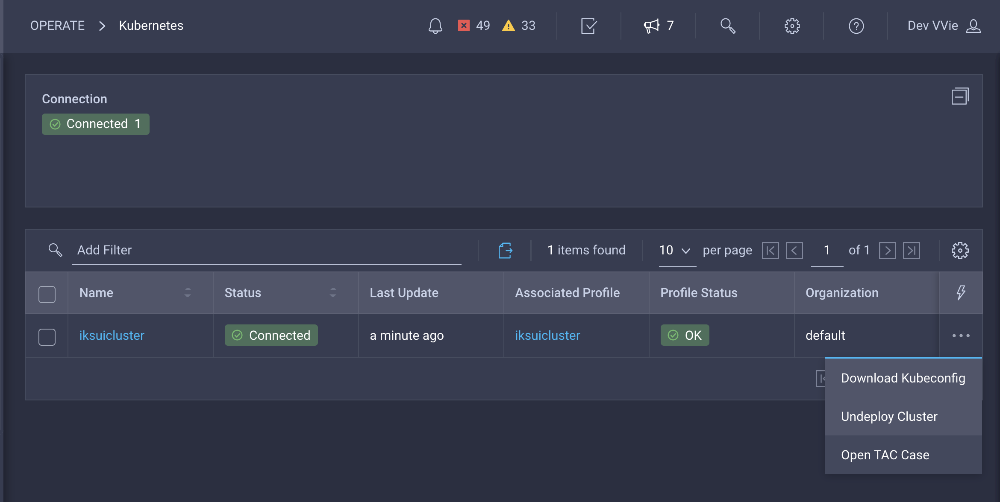
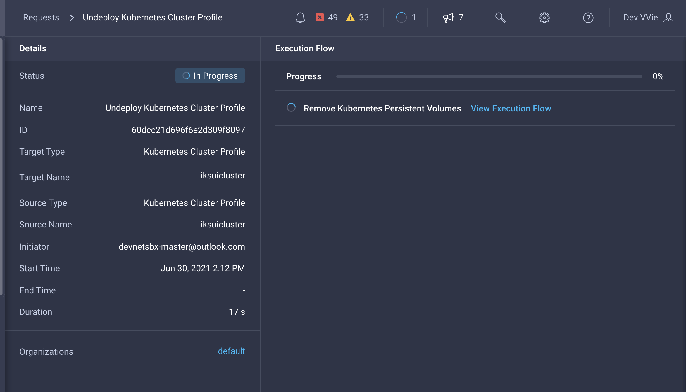
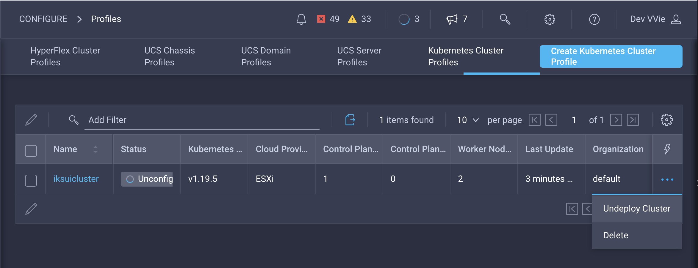
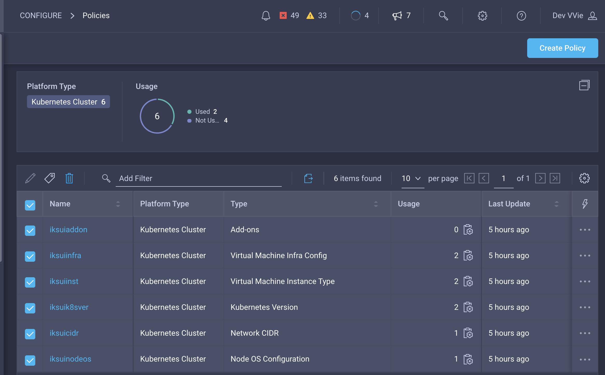

# Terminating the IKS cluster and Sandbox

After you have completed the Lab, clean up your clusters and the Sandbox.

## Use Intersight UI to Undeploy IKS cluster

Select cluster profile and Undeploy the IKS cluster before deleting it:

Track the workflow for the undeployment to terminate:

## Use Intersight UI to Delete IKS Profile

After cluster undeployment is done, please delete the cluster profile:

## Use Intersight UI to Delete IKS Policies

Select all the IKS policies and delete:

## Terminating you Sandbox reservation

Congratulations, you have completed this Learning Lab. We hope you got an overview of provisioning and deprovisioning IKS clusters using Intersight UI. If you would like to automate what you just did using Terraform, please check out the following sandbox:

https://devnetsandbox.cisco.com/RM/Diagram/Index/daad55dd-45f1-46c6-a1b4-7339b318c970?diagramType=Topology

Help us terminate the Sandbox and prepare it for the next labuser by gracefully ending the reservation as follows:

