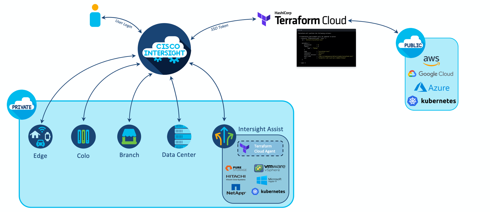

# Cisco Hybrid Cloud Content Breadboarding

## Challenge 
Cisco's Hybrid Cloud is about enabling Cisco customers to created extraordinary experiences by fusing the best of cloud and on-premises.

DevOps Engineers working on defining and deploying Cisco's Hybrid Cloud solution are faced with needing to know specialized information. DevOps consists of a multitude of personas: Developers who's focus is application planning, design and deployment. Site Reliability Engineers who's tasked with efficiently manage systems, solve problems, and automate operations that caters for developer's needs and Operation teams who architect and build infrastructer to allow for it all.

With the on going need for DevOps Engineers in the market, our customers need the ability to learn and understand Cisco's product offering that pertains to our Hybrid Cloud story. 
The current issue we are facing is the learning content is tailors to a specific persona and focused on single Cisco product. There is no course around the entire use case to answer questions like "How does Hashicorp Terraform work and why do i care for it from a Cisco Perspective?" or "why should I care about Kubernetes?" 
 
It is also challenging to build content that is relevant to different audience in the DevOPs methodology. This has to be kept in mind while building this course content. 

## What's Needed ?
New Learning content built to walk through the journey. The expectation is to spend time curating new content and deliver it in a fresh, interactive, relevant and fun way. Proposed content to be released within 2-3 Months in batches. 
- Content to be interactive 
- Cross Platform integration to focus on API utilization 
- Third party open source tooling should be incorporated as part of the learning process
- Content to tell the use case from soup to nuts
- Content to be built in a modular format to resinate to different DevOps personas (Dev, SRE, Ops)
- Check points and Badges incorporated

## Cisco Hybrid Cloud Vade Mecum

There are multilayers to understanding and learning Cloud infrastructure and deployment. The purpose of this learning course is to put the puzzle pieces together, allow our learning community to deep dive into the important pieces and place it together to see the bigger picture.

The course is designed to deliver the information in pieces and to keep building on top of the foundation. Think building a lego model. Start small and finish big.

**Compare and contrast Private cloud and Public cloud** Before we start deep diving onto the technologies in this course it would make sense to teach some of the concepts involved: what is public cloud? what is private cloud? which components are important to run your application on each. this is the foundation we will start building on top

**Introduction to Git, Gitlab, CICD** Part of allowing teams to communicate better is to teach them similar lingo, in this case we want to allow the Dev team , SRE and OPs to understand the lifecycle of app development and deployment. Bringing in Git and teaching the Devops methodologies is an important concept that will help tie the puzzle together. 

**Introduction to Containers** You need containers app development is micro services in this part of the course we should cover containers, how to build them, configure them and deployment them. this will tie in to the preview topic of CICD 

**Introduction to Kubernetes** Now that we understand containers, how do we apply orchestration to containers? this section will give us a deep dive onto kubernetes. It's important to have a Kubernetes deployed somewhere so students can get hands on with `kubectl` 

**Introduction to DNS Global Site Load Balancing** One concept that needs to be taught that's important in the hybrid cloud world is DNSGSL, how do you tell traffic to go where when you have have redundant deployment of your application. DNS Global Site load balance like Hashicrop Console or something similar can be a focus here. 

**Getting Started with Terraform** This section of the course is a big topic area that should be focused on. Terraform allows for seamless deployment of hybrid cloud. When talking about Terraform we need to focus on the HCL as a language, teach the syntax as well as the usability of Terraform + configuration. This should be a hands on , follow the instructor kind of low code session. we should also touch on how this ties in with Cisco and its products as it will be a good segway into the next topics 

**Deep dive into Private Cloud components** Here is where Cisco is a key player in hybrid cloud. this is where we start talking about Intersight and its features. this portion of the course should focus on topics like: What is Intersight (Tour du Monde), Why is it a key player in cloud Orchestration? 
We then deep dive on the key features of Intersight that allows for hybrid cloud integration things like Intersight Assist, IKS .. etc  Deep diving into this content should cover deployment, configuration. 

**Deep dive into Public Cloud components (AWS focused)** Although this is not Cisco, Public cloud providers is considered an integration point with Cisco Intersight, therefor it is important to talk about the different components that are at play from a Public cloud perspective. Understand EKS for example, VPC configuration to allow traffic between the different cloud instances and Security. This can easily be consumed from third party content creators and leveraged as part of this course 

## Content
Presonas - `|Dev|SRE|OPS|` 

Platforms - (C)isco  (T)hird Party (Udemy, Codeacademy ...etc)
#### Course Core
* Compare and contrast Private cloud and Public cloud `|Dev|SRE|OPS|` (C)(T)
* Introduction to Git, Gitlab, CICD `|Dev|SRE|OPS|` (C)(T)
* Introduction to Containers `|Dev|SRE|OPS|` (C)(T)
* Introduction to Kubernetes `|Dev|SRE|OPS|` (C)(T)
* Introduction to DNS Global Site Load Balancing (Hashicorp Console?) `|Dev|SRE|OPS|` (C)(T)
* Getting Started with Terraform `|Dev|SRE|OPS|` (C)(T)
* Deep dive into Private Cloud components `SRE|OPS|` (C)
   	- Cisco Intersight `|SRE|OPS|` (C)
   	- Intersight Assist `|OPS|` (C)
   	- Intersight Kubernetes Service (IKS) `|OPS|` (C)
   	- Intersight workflow optimizer (IWO) `|SRE|OPS|` (C)
   	- Terraform and Cisco Intersight `|SRE|OPS|` (C)
   	- Cloud OnRamp with SDWAN (vMX) `|OPS|` (C)
   	- Container Security with PortShift `|OPS|` (C)
* Deep dive into Public Cloud components (AWS focused)
	-  Getting started with AWS (Tools, SDKs, CLI)  `|Dev|SRE|OPS|`  (C)(T)
	-  Elastic Kubernetes Cluster `|Dev|SRE|OPS|` (C)(T)
	-  Virtual Private Cloud `|Dev|SRE|OPS|` (C)(T)
	-  Security and IAM `|Dev|SRE|OPS|` (C)(T)
	

#### Course Optional Module - DataCenter Networking
`This content should be present part of CCNP Data Center course`

* ACI Deployment and Config
* ACI Anywhere (Cloud APIC)

#### Course optional Module - DataCenter Compute
`This content should be present part of CCNP Data Center Core course`

* UCS Deployment
* Understanding UCS Manager B series vs UCS Manager with HX
* Building service templates 
* Understand HX and deployment capabilities  

#### Course optional Module - Networking
`This content should be present part of CCNP Networking course`

* Network deployment and Architecture 
* Routing/Switching
* Network Architecture designs  

## Rabbit Holes
Providing access to public cloud 

## No Goes